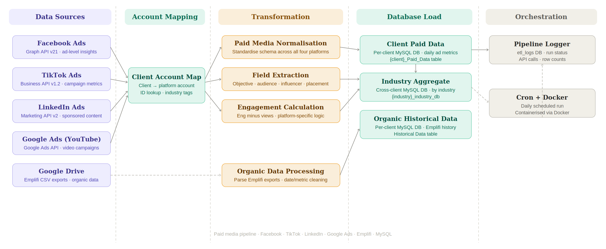

# ETL Pipeline
This pipeline extracts paid and organic social media data from five sources — Facebook Ads, TikTok Ads, LinkedIn Ads, Google Ads (YouTube), and Google Drive (Emplifi exports) — transforms and standardises it across a shared schema, and loads it into a MySQL database. Client data is written to individual per-client databases and simultaneously routed to cross-client industry aggregate tables, enabling both granular reporting and benchmarking across accounts. All pipeline runs, API calls, and row-level operations are logged to a dedicated `etl_logs` database for observability and debugging.

This was built in collaboration with Codebugged Research company.

## Pipeline Architecture


## Environment Variables
The pipeline expects several credentials to be available as environment variables or in a `.env`/`keys.env` file:
- `DB_USER` – database username
- `DB_PASSWORD` – database password
- `DB_HOST` – database host
API tokens such as `fb_access_token`, `tiktok_access_token`, `linkedin_access_token`, and the Google Ads credentials shown in `keys.env` should also be provided in the environment.
For accessing Google Drive, set:
- `google_drive_client_secret` – contents of the Drive OAuth client secret JSON
- `google_drive_token` – OAuth token JSON generated for Drive access
## Setup
1. Install Python 3.10+ and clone this repository.
2. Install the dependencies:
   ```bash
   pip install -r requirements.txt
   ```
3. Create a `.env` or `keys.env` file and provide all required credentials. A minimal example:
   ```env
   DB_USER=myuser
   DB_PASSWORD=mypassword
   DB_HOST=localhost
   FB_ACCESS_TOKEN=<your fb token>
   TIKTOK_ACCESS_TOKEN=<your tiktok token>
   LINKEDIN_ACCESS_TOKEN=<your linkedin token>
   GOOGLE_ADS_DEVELOPER_TOKEN=<google developer token>
   GOOGLE_ADS_CLIENT_ID=<client id>
   GOOGLE_ADS_CLIENT_SECRET=<client secret>
   GOOGLE_ADS_REFRESH_TOKEN=<refresh token>
   google_drive_client_secret={...json...}
   google_drive_token={...json...}
   ```
   These values can also be exported directly in your shell environment.
## Running the ETL
Run the pipeline directly:
```bash
python load.py
```
Alternatively, build and run the Docker image:
```bash
docker build -t etl-pipeline .
docker run --env-file keys.env etl-pipeline
```
The `load.py` module orchestrates extraction from the various APIs, applies transformations, and loads the final tables into the target MySQL database.
## Workflow Overview
1. **Mapping** – `mapping.generate_mapping()` uses your API credentials to discover advertising accounts.
2. **Extraction** – `extract.py` pulls raw data from Facebook, TikTok, LinkedIn and YouTube APIs.
3. **Transformation** – `transform.py` cleans and standardises the datasets.
4. **Load** – `load.main()` writes the consolidated data into your database and logs the run using `app_logging.py`.
5. **Drive Monitor** – `drive_monitor.py` can ingest Google Sheets for additional reporting.
